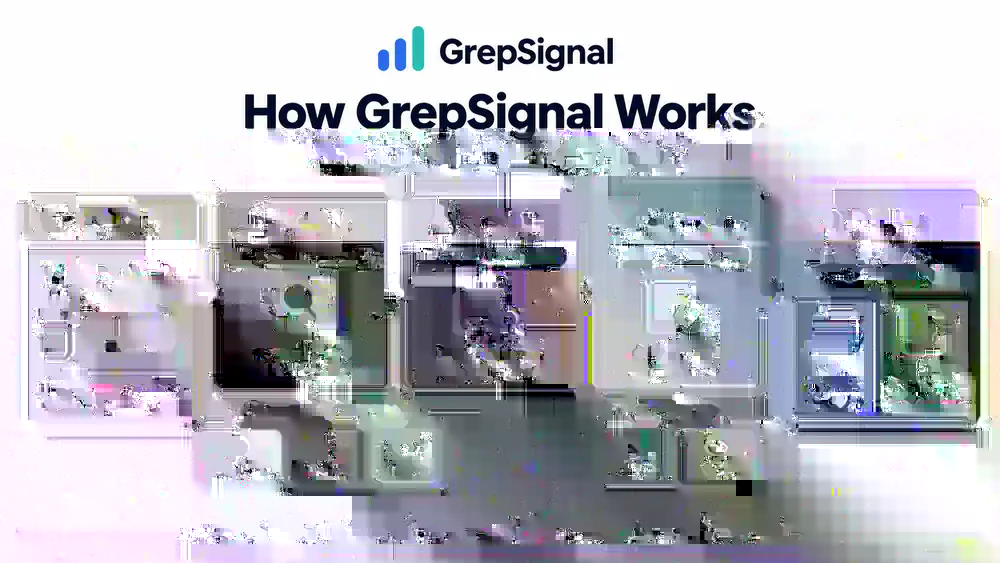

# GrepSignal

> **grep the noise, find the signal.**

Know what is worth remembering—and which judgments need to change.

GrepSignal's beta tracks **agent infrastructure and technical adoption**: runtime boundaries, tools and conventions, machine access, and operating constraints. This public repository contains a static publication and machine-readable intelligence, not a comprehensive AI news feed or a self-hostable autonomous intelligence engine.

It is intentionally separate from the private `grepsignal-engine`. Only publication-safe material belongs here: approved original analysis, source links/metadata, public schemas and the static site. Raw scraped content, private prompts, engine heuristics, temporary images and secrets do not belong here. Opening a reusable engine is a later roadmap item; no private operating data is made public by this work.

## How GrepSignal works



GrepSignal uses LLM-assisted semantic review and evidence gathering to interpret candidates and collect context. Publication is constrained by an evidence-backed signal gate: candidates can be marked `out of scope`, `no signal`, `watch` or `defer` instead of being published. Programs preserve and validate records; they do not establish truth. Editors accept publication and material judgment changes. A merged PR is not a claim that a human independently read every original source.

Read the [editorial and correction policy](https://cinic0101.github.io/grepsignal/editorial/), [policy cases](docs/editorial-cases.md), [contribution guide](CONTRIBUTING.md) and [integrated roadmap](docs/roadmap.md).

## Evidence and usage feedback

Use [Evidence or challenge](https://github.com/cinic0101/grepsignal/issues/new?template=evidence.yml) for a source-backed challenge or a missed event. Use [Usage or integration feedback](https://github.com/cinic0101/grepsignal/issues/new?template=usage.yml) for an actual task and result. English, 繁體中文 and 简体中文 submissions are welcome; published intelligence remains canonical English.

Issues are public, untrusted intake, not votes on truth or automatic publication. Submit original links and your explanation, not third-party article bodies, credentials, personal data or private documents. Actual readership, machine consumption and independent software deployment are separate things to validate; stars and crawler requests are not proof of adoption.

## v0.1 beta

- Astro static site, English canonical content.
- Research-journal × light-terminal visual style.
- No third-party article images.
- JSON is a first-class public output; HTML is a presentation layer.
- Published records expose evidence links, falsifiers and limitations; discovery channels such as Hacker News are not counted as factual evidence.
- Active Threads keep durable, provenance-linked revision history so a thesis can strengthen, weaken or change without requiring a new standalone Signal.
- Optional browser-local AI reading aid using WebGPU; canonical intelligence remains static and model-independent.
- GitHub Pages remains the initial dogfood target. Domain, hosting and feature expansion are not prerequisites for validating the core workflow.

## Local Explain (experimental; no feature expansion in A/B/C)

Signal pages can optionally run a small language model locally in a WebGPU-capable browser after explicit user opt-in and a one-time model download. The feature is a reading aid for intelligence that has already passed editorial review; it does not participate in discovery, research, signal gating or publication.

Current constrained reading aids:

- **Signal · What changed?** — a simpler reading of the published summary.
- **Signal · Why could it matter?** — a simpler reading of `why_it_matters`, preserving uncertainty and scope.
- **Thread · Thread in plain English** — a simpler reading of the thesis and approved evidence-map descriptions.
- **Thread · What changed recently?** — a simpler reading of the latest published Thread revision only.

Published evidence, falsifiers, limitations, Thread boundaries and canonical analysis remain authoritative. Limitations/boundaries are rendered directly from the canonical record, not generated. Local Explain never writes back or participates in promotion. Inference runs in the browser; no inference backend is required. If unavailable, the normal static site and published intelligence remain usable. The beta was exercised in Chrome and Safari during development; that is not a guarantee for every device/version.

## Discoverability

> **Never create content because a keyword exists. Make genuine signals maximally discoverable.**

SEO/AEO is a publication concern, not an editorial input. Stable URLs, semantic HTML, canonical metadata, sitemaps and machine-readable outputs expose already-reviewed intelligence. Search demand must not create a signal, lower its threshold or justify filler pages.

## Local development

```sh
npm install
npm run dev
npm run build
```

Development uses `/`; GitHub Actions builds with `/grepsignal/`. A future deployment can set `PUBLIC_BASE_PATH=/` and its own `PUBLIC_SITE_URL`. The deploy workflow builds `dist/` and publishes it through GitHub Pages.

## Public data boundary

`scripts/validate-data.mjs` blocks obvious private/raw fields. Published records require linked evidence, matching source counts, source-organization counts, falsifiers, limitations, registration date, evidence-history date, and credential-free HTTPS source URLs. Structural validation is not a substitute for editorial/IP review or proof of truth. No forecast or weakening is manufactured to demonstrate a feature.

## Licenses

Software source, scripts, schemas, configuration and site implementation remain under [Apache-2.0](LICENSE).

Authorized original published GrepSignal intelligence and editorial analysis are under [CC BY 4.0](LICENSE-CONTENT.md). Credit GrepSignal, link the record and license, and indicate modifications under the license terms. This covers the original records distributed with that notice; it does not invent a historical license-effective date.

Third-party source material is excluded and remains subject to its owners' rights. Private drafts, raw caches, credentials and operational data are neither published nor covered by the content grant. See the content notice for the complete boundary.

## Accountability journal (schema v2)

`src/data/intelligence.json` and `thread-links.json` are pinned legacy baselines, **not the current head**. Append accepted events to `src/data/history.json`; `src/data/intelligence.ts` derives pages and the current `/data/intelligence.json`. Never edit baselines to publish a finding. See `docs/accountability.md`.

Changes: `/changes/`, `/data/changes.json`, `/data/history.json`, `/atom.xml`. Migration adds no fake review, correction or forecast. Earlier Thread history stays intact. Unknown first-publication times remain unknown.
